<div align="center">



<br/>

<p align="center">
  <a href="https://curiousstitches.github.io/InfiniteWorldAI/"></a>
  &nbsp;
  <a href="https://stackblitz.com/github/curiousstitches/InfiniteWorldAI"></a>
  &nbsp;
  <a href="https://gitpod.io/#https://github.com/curiousstitches/InfiniteWorldAI"></a>
</p>

<p align="center">
  
  
  
  
  
</p>

</div>

<br/>

> **Voice-driven AI-native 3D world engine.** Birth a never-ending story with a lifelike companion. Whispers-tier visuals. Runs on your phone.

---

## 🚀 Try it in 10 seconds

**Three zero-install options — pick one:**

<table>
  <tr>
    <td align="center" width="33%">
      <h3>▶ Live Demo</h3>
      <p>Scripted companion, real visuals, instant.</p>
      <a href="https://curiousstitches.github.io/InfiniteWorldAI/">
        
      </a>
      <br/><sub>No install · No backend · Canned dialogue</sub>
    </td>
    <td align="center" width="33%">
      <h3>⚡ StackBlitz</h3>
      <p>Full app in a browser-based VS Code.</p>
      <a href="https://stackblitz.com/github/curiousstitches/InfiniteWorldAI">
        
      </a>
      <br/><sub>One click · Boots Node · Add your API keys</sub>
    </td>
    <td align="center" width="33%">
      <h3>💻 Gitpod</h3>
      <p>Full cloud IDE with all deps pre-installed.</p>
      <a href="https://gitpod.io/#https://github.com/curiousstitches/InfiniteWorldAI">
        
      </a>
      <br/><sub>50hrs/mo free · Full backend works</sub>
    </td>
  </tr>
</table>

---

## 🎬 What it looks like

<div align="center">
  
  
  
  
</div>

---

## 🧠 How it works

<div align="center">
  
</div>

Three LLMs run in parallel every turn — **World GM** drives narrative, **Companion** drives dialogue + emotion, **Task Generator** spawns objectives — synthesized into a single coherent response in under 1.5s on free-tier providers.

---

## 💾 Install locally

<table>
<tr>
<td>

### 🅰️ One-line install (Termux / Linux / macOS)

```bash
curl -fsSL https://raw.githubusercontent.com/curiousstitches/InfiniteWorldAI/main/install.sh | bash
```

Auto-detects platform, installs Node + git + build tools, clones repo, runs `npm install`, scaffolds `.env`. Done in ~3 min.

</td>
</tr>
<tr>
<td>

### 🅱️ Docker (Mac/Windows/Linux)

```bash
git clone https://github.com/curiousstitches/InfiniteWorldAI.git && cd InfiniteWorldAI
docker compose up
```

Single container. Zero Node version pain. Open `http://localhost:3001`.

</td>
</tr>
<tr>
<td>

### 🅲 Manual clone

```bash
git clone https://github.com/curiousstitches/InfiniteWorldAI.git && cd InfiniteWorldAI
npm install --prefix server && npm install --prefix client && cp .env.example .env
node server/index.js &
npm run dev --prefix client -- --host
```

</td>
</tr>
</table>

---

## 🚀 Deploy your own demo

<details>
<summary><b>🅰️ Vercel + Render</b> &nbsp;·&nbsp; ★ recommended &nbsp;·&nbsp; free · ~3 min</summary>

<br/>

**Frontend on Vercel, backend on Render. Both auto-deploy from GitHub.**

### 1. Backend → Render
1. [render.com](https://render.com) → sign in with GitHub
2. **New → Web Service** → pick `InfiniteWorldAI`
3. Settings:
   - **Root Directory:** `server`
   - **Build:** `npm install`
   - **Start:** `node index.js`
   - Add env vars (all optional)
4. **Create**. Copy the `https://...onrender.com` URL.

### 2. Frontend → Vercel
1. [vercel.com](https://vercel.com) → sign in with GitHub
2. **Add New → Project** → import `InfiniteWorldAI`
3. **Root Directory:** `client` · **Framework:** Vite (auto)
4. Add env var: `VITE_API_URL=<Render URL from step 1>`
5. **Deploy** → `https://infiniteworldai.vercel.app`

**Cost:** $0/mo. Render free spins down after 15 min idle (~30s cold start).

</details>

<details>
<summary><b>🅱️ Railway</b> &nbsp;·&nbsp; single platform · $5/mo after trial</summary>

<br/>

1. [railway.app](https://railway.app) → connect GitHub → pick `InfiniteWorldAI`
2. Add **two services**: server (`root=server, start=node index.js`) and client (`root=client, build=npm run build`)
3. **Settings → Networking → Generate Domain** on both
4. Add env vars under Variables

**Cost:** $5 trial credit, then ~$5–10/mo. No cold starts.

</details>

<details>
<summary><b>🅲 Cloudflare Pages + Workers</b> &nbsp;·&nbsp; fastest globally · free · trickier</summary>

<br/>

Frontend → Cloudflare Pages straight from your repo. Backend either stays on Render (easy) or gets rewritten to Hono + D1 (half-day refactor).

</details>

<details>
<summary><b>🅳 Termux + Cloudflare Tunnel</b> &nbsp;·&nbsp; self-host on your phone · free forever</summary>

<br/>

```bash
pkg install -y cloudflared
cloudflared tunnel --url http://localhost:3001
```

Phone must stay on; URLs change each restart unless you make a [named tunnel](https://developers.cloudflare.com/cloudflare-one/connections/connect-networks/get-started/create-local-tunnel/).

</details>

<details>
<summary><b>🅴 GitHub Pages</b> &nbsp;·&nbsp; demo-mode auto-deploys ✓ already enabled</summary>

<br/>

The `.github/workflows/deploy-demo.yml` workflow builds with `DEMO_MODE=true` and deploys to Pages on every push to `main`.

**To enable** (one-time, 30 seconds):
1. **[Settings → Pages](https://github.com/curiousstitches/InfiniteWorldAI/settings/pages)**
2. **Source** → **GitHub Actions** → save
3. **[Actions tab](https://github.com/curiousstitches/InfiniteWorldAI/actions)** → **Deploy Demo to GitHub Pages** → **Run workflow**
4. Wait ~2 min → live at `https://curiousstitches.github.io/InfiniteWorldAI/`

Demo runs scripted dialogue only — pair with Render (Option A) for full AI.

</details>

---

## 🔑 Pushing your own fork

```bash
cd InfiniteWorldAI && ./push.sh
```

Prompts for: GitHub username · repo name · commit message · **[Personal Access Token](https://github.com/settings/tokens/new)** with `repo` scope. Token is scrubbed from `.git/config` after push. See [push.sh](push.sh) for source.

---

## 📦 What's inside

<details>
<summary><b>🎬 Visuals — the Whispers-tier pipeline</b></summary>

<br/>

| Layer | What it does |
|---|---|
| **Camera Controller** | Hybrid — first-person exploration + over-shoulder dialogue + free-orbit |
| **Capability Autodetector** | Boot-time GPU benchmark → tier slug |
| **Tier Presets** | 4 levels × ~25 feature flags each |
| **Environment Manager** | Per-biome HDRI + volumetric sky fallback |
| **Sky Shader** | Custom GLSL — sun disc + Rayleigh + FBM clouds |
| **Skin Shader (SSS)** | PBR with subsurface translucency + clearcoat + anisotropic hair |
| **Terrain HQ** | Heightmap-displaced PBR terrain |
| **Vegetation** | Instanced trees / grass / mushrooms / crystals with wind |
| **Post-process** | ACES + bokeh DOF (focus on companion) + eye adaptation + SSAO + bloom + grain |
| **Mesh Source** | Pluggable — Meshy realistic + auto-rig active; RPM stubbed for future |

</details>

<details>
<summary><b>🔌 Provider system — 40+ LLM/TTS providers with auto-fallback</b></summary>

<br/>

- **S-tier** (lifelike): Puter (Claude Opus 4.7, GPT-5.5 Pro, Gemini 3.1 Pro), 9router → Kiro/Vertex
- **A-tier** (high quality): Google AI Studio · Mistral · xAI Grok-4 · Inworld TTS · Cartesia
- **B-tier** (fast free): Groq (Whisper Turbo @ 315 TPS) · Cerebras · OpenRouter free · GitHub Models
- **C-tier** (fallback): OpenCode Free · Cohere · Cloudflare · HuggingFace · Together

**Voice cascade:**
STT: Web Speech → Groq Whisper → 9router → Puter → paid
TTS: ElevenLabs Turbo v2.5 → Inworld → Cartesia → Puter → Web Speech

See [`PROVIDERS.md`](PROVIDERS.md) for the full matrix.

</details>

<details>
<summary><b>🧬 Personality engine — OCEAN + sub-traits + speech style</b></summary>

<br/>

Structured personality schema — Big Five + sub-traits + attachment style + speech patterns + quirks + backstory. Per-turn frozen instruction block. Model emits hidden state deltas (`<state mood= affection_delta= trust_delta=/>`) that adjust the relationship over time.

Customize in **Settings → Personality** with master + per-section randomizers.

</details>

<details>
<summary><b>⚙️ Environment variables</b></summary>

<br/>

Every key is optional — free path works with none.

| Key | Purpose | Where to get it |
|---|---|---|
| `OPENAI_API_KEY` | Default LLM agent | platform.openai.com |
| `ANTHROPIC_API_KEY` | Claude direct | console.anthropic.com |
| `GROQ_API_KEY` | Free Whisper Turbo + Llama | console.groq.com |
| `GOOGLE_API_KEY` | Free Gemini 1500 RPD | aistudio.google.com |
| `ELEVENLABS_API_KEY` | Lifelike TTS | elevenlabs.io |
| `MESHY_API_KEY` | 3D companion mesh | meshy.ai |
| `NINEROUTER_BASE_URL` | Local 9router proxy | `http://localhost:20128/v1` |
| `PORT` | Backend port | default `3001` |
| `DB_PATH` | SQLite path | default `./data/infiniteworlds.db` |

</details>

<details>
<summary><b>🎨 Brand & press kit</b></summary>

<br/>

`/.github/assets/brand/` has logo (full + wordmark + mark, light/dark), palette, typography. Primary `#cc88ff` · accent `#88ddff` · lifelike `#ffcc88`. Guidelines: [`BRAND.md`](.github/assets/brand/BRAND.md).

</details>

<details>
<summary><b>🌿 Biomes & controls</b></summary>

<br/>

**14 biomes:** forest · ocean · desert · cave · tundra · volcanic · cosmic · ethereal · microorganism · crystalline · storm · void · ancient ruins · mushroom forest

| Action | Input |
|---|---|
| Move (FP mode) | WASD |
| Look | Mouse / touch drag |
| Orbit (orbit mode) | Touch drag / mouse drag |
| Zoom | Pinch / scroll |
| Talk | Hold mic button |
| Settings | ⚙ top-right |

</details>

<details>
<summary><b>🤝 Contributing & citing</b></summary>

<br/>

See [`CONTRIBUTING.md`](CONTRIBUTING.md) + [`CODE_OF_CONDUCT.md`](CODE_OF_CONDUCT.md).

```bibtex
@software{infiniteworldai_2026,
  author = {curiousstitches},
  title  = {InfiniteWorldAI: A voice-interactive AI-driven 3D world engine},
  year   = 2026,
  url    = {https://github.com/curiousstitches/InfiniteWorldAI}
}
```

</details>

---

<div align="center">

**Built with Babylon.js · Inspired by Whispers from the Star · MIT License**

<sub>If you ship something with this, ping me — I want to see it.</sub>

<br/><br/>

<a href="https://curiousstitches.github.io/InfiniteWorldAI/"></a>

</div>

---

## Optional: self-hosted 9router (advanced / local dev only)

9router was removed from the default build because it's a **localhost-only proxy** — it
can't be reached from a hosted deploy (Railway, etc.), so it only works when you run this
project on your own machine.

If you want to use it for free local AI across 40+ providers:

1. Install it: `github.com/decolua/9router` (runs at `http://localhost:20128/v1`, OpenAI-compatible).
2. Set an env var before starting the server:
   ```
   NINEROUTER_BASE_URL=http://localhost:20128/v1
   ```
3. Re-add provider entries to `server/services/providerRouter.js` `PROVIDER_CONFIG`
   (e.g. `'9router:kr/claude-sonnet-4.5': { baseURL: process.env.NINEROUTER_BASE_URL, key: () => 'x', model: 'kr/claude-sonnet-4.5' }`)
   and add their ids to the `DEFAULT_CASCADE` chains.

For hosted deploys, use a free key instead (Groq is easiest — `console.groq.com`, no card).
